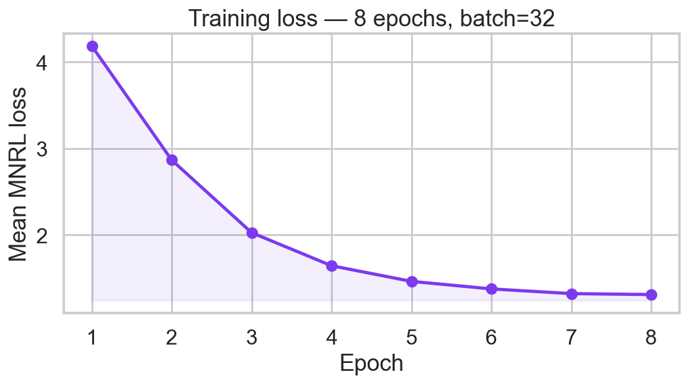
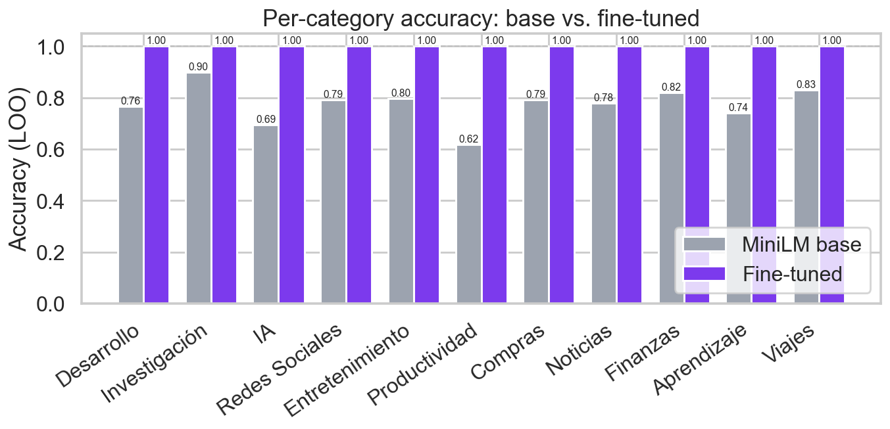
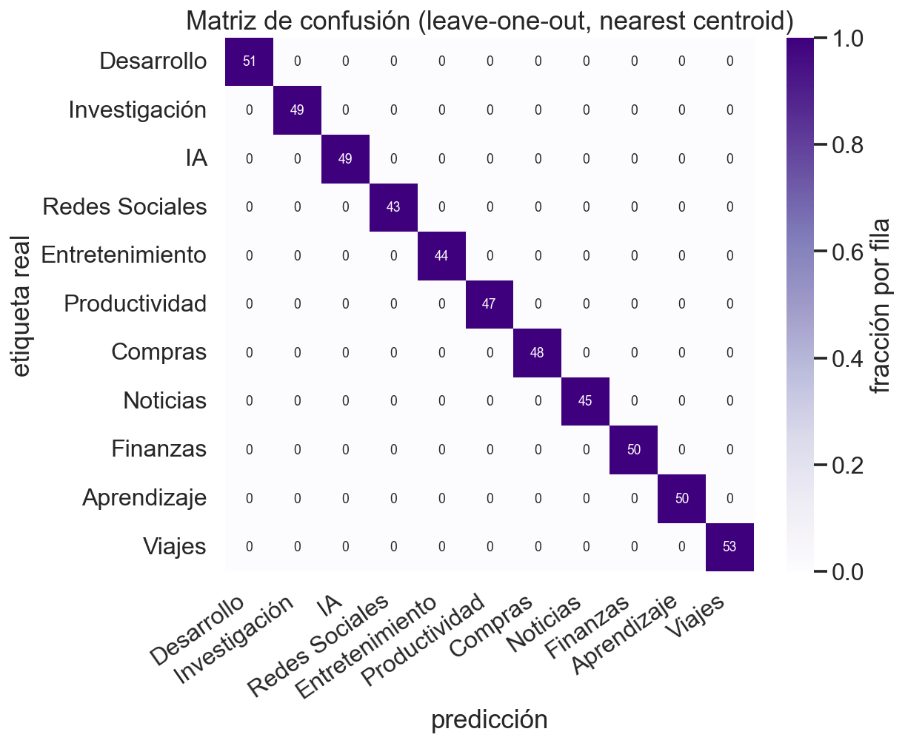
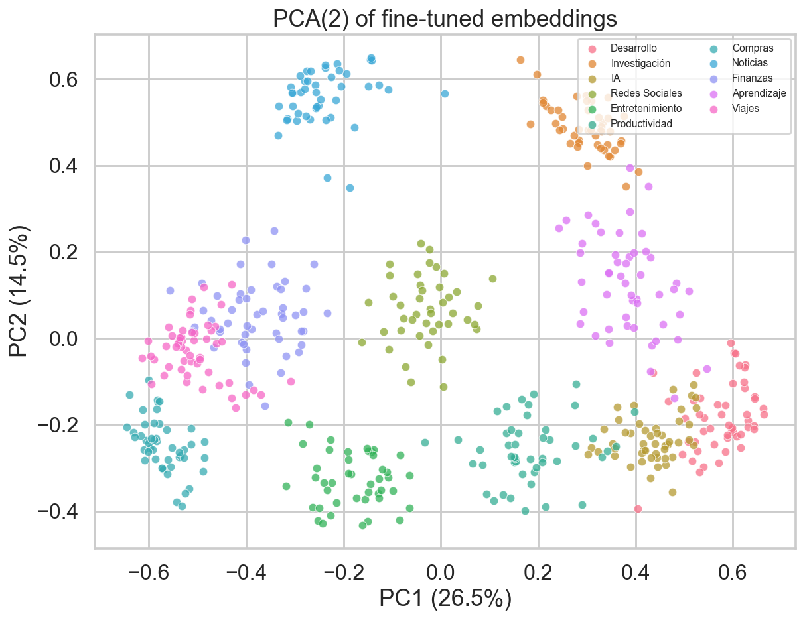
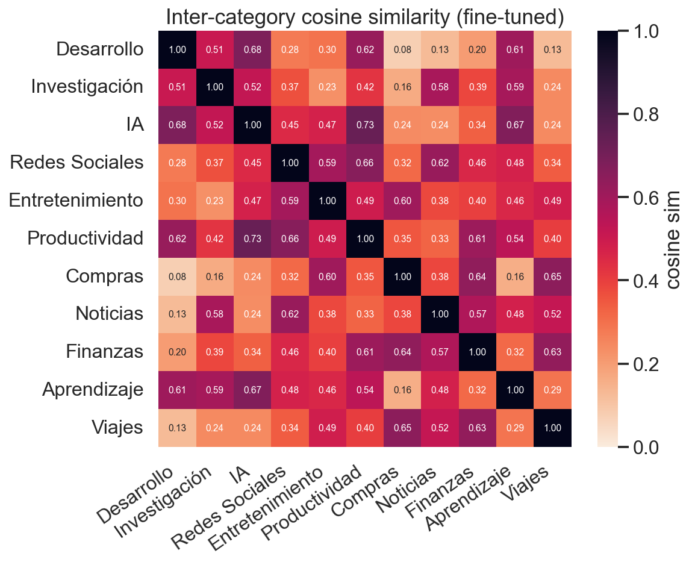

# Tab Sorter (Claude Code)

Extensión de Chrome/Chromium que agrupa tus pestañas en categorías. Dos modos:

- **Auto (local)** — un modelo MiniLM fine-tuneado, exportado a ONNX int8 (~22 MB), que corre dentro del navegador vía `transformers.js`. Clasifica al vuelo cada pestaña nueva por similitud coseno contra prototipos por categoría. Sin red, sin costes.
- **Manual (Claude)** — el popup envía todas las pestañas al **Claude Agent SDK** (`@anthropic-ai/claude-agent-sdk`) a través de un *native messaging host* local. El SDK reusa tu login OAuth de Claude Code (sin `ANTHROPIC_API_KEY`).

```
[ popup ] ──┐                                              ┌─► offscreen.js  ─► transformers.js + ONNX
            ├─► background.js (service worker) ────────────┤
auto via    │                                              │
onUpdated ──┘                                              └─► chrome.runtime.connectNative("com.diego.tabsorter")
                                                                     │
                                                                     ▼
                                                              native-host/host.js  (Node ESM)
                                                                     │  Agent SDK query() · OAuth · JSON schema
                                                                     ▼
                                                              {groups:[{name:"💻 Desarrollo", color, tabIds}]}
```

Las extensiones MV3 no pueden cargar paquetes npm ni ejecutar binarios: por eso el SDK vive en un proceso Node externo registrado en `~/Library/Application Support/.../NativeMessagingHosts/`.

## Demo

| Popup | Grupos creados |
| --- | --- |
| Stats arriba (total, ejecuciones, top categoría), split local/Claude, breakdown histórico. | Cada grupo lleva su emoji y color (`💻 Desarrollo`, `🎬 Entretenimiento`, `📰 Noticias`, …). |

Categorías disponibles para el modo local (11):
`💻 Desarrollo` · `🔬 Investigación` · `🤖 IA` · `💬 Redes Sociales` · `🎬 Entretenimiento` · `⚡ Productividad` · `🛒 Compras` · `📰 Noticias` · `💰 Finanzas` · `📚 Aprendizaje` · `✈️ Viajes`

En modo Claude las categorías son libres — el modelo elige nombres apropiados con emoji.

## Resultados del modelo local

Fine-tune de `sentence-transformers/all-MiniLM-L6-v2` con [Multiple Negatives Ranking Loss](https://www.sbert.net/docs/package_reference/losses.html#multiplenegativesrankingloss) sobre 529 ejemplos balanceados a través de 11 categorías. Después se exporta el encoder a ONNX y se cuantiza a int8.

### Configuración

| | |
| --- | --- |
| Base model | `sentence-transformers/all-MiniLM-L6-v2` (22 M params) |
| Dataset | 529 ejemplos · 11 categorías · ~48/categoría |
| Pares de entrenamiento | 2116 (4 positivos por ejemplo) |
| Epochs / batch | 8 / 32 |
| Optimizador | AdamW, lr=2e-5, warmup=100 |
| Loss | MultipleNegativesRankingLoss |
| Modelo final | 22.3 MB (ONNX q8) |

### Loss de entrenamiento



Loss medio por epoch (MNRL). Baja de 4.18 → 1.31 en 8 epochs; se aplana a partir del epoch 6, indicando convergencia razonable sobre este corpus pequeño.

### Accuracy vs. modelo base

Evaluación leave-one-out con clasificación por centroide más cercano (cada ejemplo se clasifica contra los centroides construidos con los **otros** ejemplos de su categoría):

|                     | Overall | Δ vs. base |
| ------------------- | ------- | ---------- |
| MiniLM base         | **77.5 %** | — |
| Fine-tuned (este repo) | **100.0 %** | **+22.5 pp** |



El modelo base sufre especialmente en `Productividad` (0.62), `IA` (0.69) y `Aprendizaje` (0.74) — categorías con mucho solape semántico con otras (productividad↔desarrollo, IA↔desarrollo, aprendizaje↔investigación). El fine-tune separa los clusters limpiamente.

> ⚠️ 100 % LOO sobre el propio corpus de entrenamiento **no implica 100 % en producción** — es una métrica intrínseca, no un test set independiente. El probe set held-out de `train.py` (22 ejemplos nuevos) da **20/22 = 90.9 %**, que es una mejor estimación de la accuracy real. Para tu propio dataset, agrega ejemplos a `finetune/dataset.py` y vuelve a entrenar.

### Matriz de confusión (LOO)



Diagonal perfecta — sin confusiones entre categorías en LOO. (De nuevo: medida sobre el corpus de entrenamiento, ver caveat arriba.)

### Estructura del espacio de embeddings



Proyección PCA(2) de los embeddings fine-tuneados. Cada punto es una pestaña del dataset, coloreada por categoría. Los clusters son visiblemente separados pese a haber reducido 384 → 2 dimensiones; las dos primeras componentes capturan ~41 % de la varianza.



Heatmap de similitud coseno entre los centroides de cada categoría. La diagonal vale 1.0; el resto idealmente debe ser bajo. Los pares con mayor similitud residual son `Desarrollo ↔ IA` y `Investigación ↔ Aprendizaje`, lo cual coincide con el solape semántico esperado.

## Requisitos

- macOS (los paths del install script son macOS; en Linux ajusta `~/.config/google-chrome/...`)
- Estar **logueado en Claude Code** (`claude /login`) — el SDK reusa esa auth, no necesitas `ANTHROPIC_API_KEY`
- `node` en PATH

## Instalación

0. **Instalar dependencias del host:**
   ```bash
   cd native-host && npm install
   ```

1. **Cargar la extensión sin empaquetar:**
   - Abre `chrome://extensions`
   - Activa *Modo de desarrollador*
   - *Cargar sin empaquetar* → selecciona la carpeta `extension/`
   - Copia el **ID** de la extensión (cadena tipo `abcdefghijklmnop...`)

2. **Registrar el native messaging host:**
   ```bash
   ./install.sh <EXTENSION_ID>            # Chrome
   ./install.sh <EXTENSION_ID> brave      # Brave
   ./install.sh <EXTENSION_ID> arc        # Arc
   ./install.sh <EXTENSION_ID> edge       # Edge
   ```

3. **Reinicia el navegador** (cierra todas las ventanas para que recargue los hosts).

4. Abre el popup, activa *Auto* (para clasificación local de pestañas nuevas) o pulsa **Categorizar con Claude** (para procesar todas las pestañas en lote).

## Uso

- **Auto** → al cargar una pestaña nueva, el modelo local la clasifica y la mete en su grupo. Funciona offline y sin coste.
- **Categorizar con Claude** → llama a `claude -p` con el listado y crea grupos nativos de Chrome.
- **Deshacer grupos** → quita todos los grupos del ámbito actual.
- Selector de modelo Claude: `haiku` (más barato/rápido), `sonnet`, `opus`.
- Selector de ámbito: ventana actual o todas las ventanas.

El popup muestra estadísticas: total de pestañas clasificadas, número de ejecuciones, categoría más usada, y split entre el modelo local (🤖) y Claude (✨).

## Logs / debug

- Native host: `~/.claude-tab-sorter.log`
- Popup: clic derecho sobre el icono → *Inspeccionar popup* → consola
- Service worker: `chrome://extensions` → *Inspeccionar vista: background worker*
- Offscreen (modelo local): `chrome://extensions` → *Inspeccionar vista: offscreen.html*

## Test manual del host (sin extensión)

```bash
node -e '
  const m = JSON.stringify({
    type: "categorize",
    model: "haiku",
    tabs: [
      {id:1,title:"GitHub",url:"https://github.com"},
      {id:2,title:"YouTube",url:"https://youtube.com"},
      {id:3,title:"MDN docs",url:"https://developer.mozilla.org"}
    ]
  });
  const b = Buffer.from(m);
  const h = Buffer.alloc(4); h.writeUInt32LE(b.length, 0);
  process.stdout.write(Buffer.concat([h, b]));
' | node native-host/host.js | node -e '
  let buf = Buffer.alloc(0);
  process.stdin.on("data", c => buf = Buffer.concat([buf, c]));
  process.stdin.on("end", () => {
    const len = buf.readUInt32LE(0);
    console.log(JSON.stringify(JSON.parse(buf.subarray(4, 4 + len).toString()), null, 2));
  });
'
```

## Estructura

```
claude-tab-sorter/
├── extension/                     Extensión Chrome MV3
│   ├── manifest.json              Permisos: tabs, tabGroups, nativeMessaging, storage, offscreen
│   ├── popup.html / .css / .js    UI: stats + controles + resultados
│   ├── background.js              Service worker: native messaging, auto-clasificación, stats
│   ├── offscreen.html / .js       Host del modelo local (transformers.js + ONNX)
│   ├── prototypes.js              11 categorías × ~15 ejemplos para construir centroides
│   ├── models/tab-classifier-v1/  Modelo ONNX int8 + tokenizer
│   ├── lib/                       Bundle de transformers.js + ONNX Runtime WASM
│   └── src/                       Entrada para esbuild
├── native-host/
│   ├── host.js                    ESM, framed stdio + Agent SDK query() con json_schema
│   ├── host.sh                    Wrapper con PATH para apps GUI macOS
│   └── package.json               Declara @anthropic-ai/claude-agent-sdk
├── finetune/
│   ├── dataset.py                 529 ejemplos etiquetados por categoría
│   ├── train.py                   Fine-tune con MNRL + captura de loss por epoch
│   ├── export.py                  HF → ONNX → cuantización int8 → layout transformers.js
│   └── evaluate.py                Métricas + plots (confusion matrix, PCA, similarity)
├── docs/                          Gráficas embebidas en este README
│   ├── training_loss.png
│   ├── confusion_matrix.png
│   ├── category_accuracy.png
│   ├── category_similarity.png
│   ├── embedding_clusters.png
│   └── evaluation.json
├── install.sh                     Registra el host en NativeMessagingHosts/
├── CLAUDE.md                      Guía para futuros agentes Claude Code
└── README.md
```

## Recolectar tu propio dataset

La extensión incluye un recolector opt-in de eventos de clasificación que convierte tu navegación real en material de entrenamiento para mejorar el modelo local con tu uso específico.

### Flujo

1. **Activar** la casilla *Recolectar dataset* en el popup. La opción está apagada por defecto.
2. **Navegar normalmente** con *Auto* activado (clasificación local) y/o usar *Categorizar con Claude* periódicamente. Cada pestaña que el modelo etiqueta queda guardada en `chrome.storage.local.dataset` junto con el título, host, predicción, score de similitud, color, y la fuente (`auto` / `claude` / `manual`).
   - **Bonus — captura de movimientos manuales (✋).** Cuando arrastras una pestaña a otro grupo o la metes en uno nuevo desde el menú de Chrome, la extensión lo detecta y trata el destino como la **etiqueta correcta**. Si había una predicción previa para esa URL, se marca como corregida (`userCategory` + `manualMove: true`). Si no la había, se crea una entrada `source: "manual"` con la categoría que tú elegiste. Es la señal de mayor calidad para entrenar: el usuario "te enseña" sin abrir el visor.
3. **Abrir el visor** (link "abrir" junto al toggle, o `chrome-extension://<ID>/dataset.html`). Verás una tabla paginada con filtros por texto, fuente, categoría y estado (sin confirmar, confirmados, corregidos, sin categoría).
4. **Corregir** los casos en que el modelo se equivocó: el dropdown "Etiqueta final" de cada fila te deja reasignar, y la barra superior permite reasignación en bloque. Las correcciones quedan marcadas como `userCategory`.
5. **Exportar** cuando tengas suficientes ejemplos:
   - `Exportar JSONL` → un evento por línea, ideal para inspección o pipelines externos.
   - `Exportar dataset.py` → archivo Python listo para **reemplazar `finetune/dataset.py`** (agrupa por etiqueta final, dedup automático).

### Re-entrenamiento con datos reales

```bash
cp ~/Downloads/dataset-2026-*.py finetune/dataset.py
cd finetune && source .venv/bin/activate
python train.py && python export.py && python evaluate.py
```

Después recarga la extensión y bumpea `PROTO_VERSION` en `extension/prototypes.js` para invalidar la cache de prototipos.

### Privacidad

- Todo se guarda **local** en `chrome.storage.local` (con `unlimitedStorage`). No hay red.
- URLs y títulos se truncan: el host + primeros 80 chars del pathname y los primeros 200 chars del título.
- Botón *Vaciar* borra todo el dataset. Desactiva el toggle para detener la recolección.
- Tope de seguridad: 50 000 eventos (se rotan los más antiguos).

## Re-entrenar el modelo local

Si quieres entrenar tu propio clasificador (más categorías, más ejemplos, otro idioma):

```bash
cd finetune
python -m venv .venv && source .venv/bin/activate
pip install sentence-transformers optimum[onnxruntime] matplotlib seaborn scikit-learn
# Edita dataset.py: agrega categorías o ejemplos
python train.py       # ~80 s en M1 (MPS), guarda output/finetuned + output/training_metrics.json
python export.py      # convierte a ONNX int8 y copia a extension/models/tab-classifier-v1/
python evaluate.py    # regenera plots en docs/ + docs/evaluation.json
```

Después recarga la extensión y bumpea `PROTO_VERSION` en `extension/prototypes.js` para invalidar la cache de prototipos.

## Notas

- El host llama a `query()` del Agent SDK con `allowedTools: []`, `maxTurns: 1` y un `system_prompt` que fuerza salida JSON estricta. El SDK valida internamente contra el schema y devuelve `message.structured_output`.
- El SDK de TS empaqueta el binario nativo de Claude Code (`@anthropic-ai/claude-agent-sdk-darwin-arm64`) como optional dependency, así que reusa la sesión OAuth que ya tienes con `claude` — sin API key.
- El ID de extensión cambia entre cargas sin empaquetar; si lo recargas con otra carpeta tendrás que re-ejecutar `install.sh`.
- A partir del 15-jun-2026 el uso del SDK con suscripción consumirá del "Agent SDK credit" mensual ([detalles](https://support.claude.com/en/articles/15036540-use-the-claude-agent-sdk-with-your-claude-plan)).
