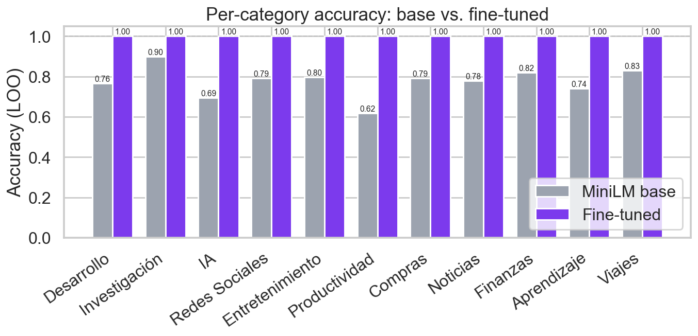
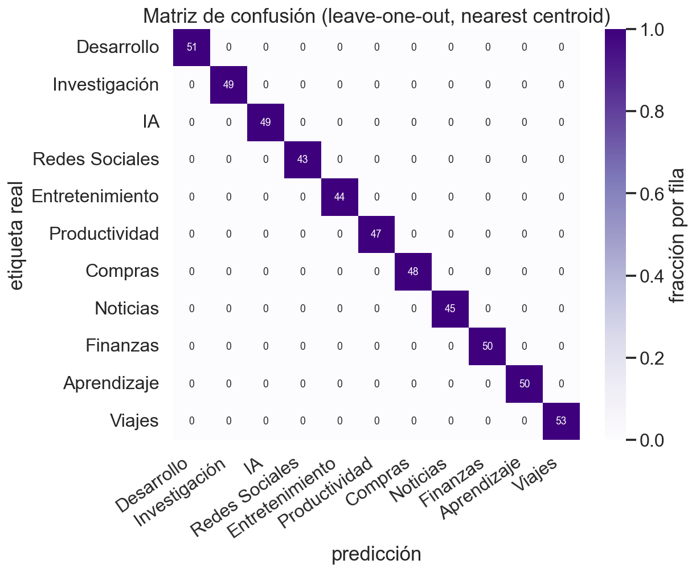

# Tab Sorter (Claude Code)

Extensión de Chrome/Chromium que agrupa tus pestañas en categorías. Dos modos:

- **Auto (local)** — un modelo MiniLM fine-tuneado sobre navegación real, exportado a ONNX int8 (~23 MB), que corre dentro del navegador vía `transformers.js`. Clasifica al vuelo cada pestaña nueva por similitud coseno contra los centroides de cada categoría. Sin red, sin costes. **83.5 % de accuracy** (91.4 % ponderado por las pestañas que más abres).
- **Manual (Claude)** — el popup envía todas las pestañas al **Claude Agent SDK** (`@anthropic-ai/claude-agent-sdk`) a través de un *native messaging host* local. El SDK reusa tu login OAuth de Claude Code (sin `ANTHROPIC_API_KEY`).

```
[ popup ] ──┐                                              ┌─► offscreen.js  ─► transformers.js + ONNX
            ├─► background.js (service worker) ────────────┤
auto via    │                                              │
onUpdated ──┘                                              └─► chrome.runtime.connectNative("com.diego.tabsorter")
                                                                     │
                                                                     ▼
                                                              native-host/host.js  (Node ESM)
                                                                     │  Agent SDK query() · OAuth · JSON schema
                                                                     ▼
                                                              {groups:[{name:"💻 Desarrollo", color, tabIds}]}
```

Las extensiones MV3 no pueden cargar paquetes npm ni ejecutar binarios: por eso el SDK vive en un proceso Node externo registrado en `~/Library/Application Support/.../NativeMessagingHosts/`.

## Demo

| Popup | Grupos creados |
| --- | --- |
| Stats arriba (total, ejecuciones, top categoría), split local/Claude, breakdown histórico. | Cada grupo lleva su emoji y color (`💻 Desarrollo`, `🎬 Entretenimiento`, `📰 Noticias`, …). |

Categorías disponibles para el modo local (11):
`💻 Desarrollo` · `🔬 Investigación` · `🤖 IA` · `💬 Redes Sociales` · `🎬 Entretenimiento` · `⚡ Productividad` · `🛒 Compras` · `📰 Noticias` · `💰 Finanzas` · `📚 Aprendizaje` · `✈️ Viajes`

En modo Claude las categorías son libres — el modelo elige nombres apropiados con emoji.

## Resultados del modelo local

El clasificador está entrenado sobre **navegación real**: 4053 pestañas recogidas durante dos meses de uso, deduplicadas a 2017 items únicos y re-etiquetadas de forma independiente. Fine-tune de `sentence-transformers/all-MiniLM-L6-v2` con [Multiple Negatives Ranking Loss](https://www.sbert.net/docs/package_reference/losses.html#multiplenegativesrankingloss), exportado a ONNX y cuantizado a int8.

### Configuración

| | |
| --- | --- |
| Base model | `sentence-transformers/all-MiniLM-L6-v2` (22 M params) |
| Corpus | 2017 pestañas reales · 285 hosts · 11 categorías · jun–ago 2026 |
| Etiquetado | 14 anotadores LLM independientes, sectorizados por host |
| Pares de entrenamiento | 6412 (4 positivos por ejemplo) |
| Epochs / batch | 8 / 32 |
| Optimizador | AdamW, lr=2e-5, warmup=100 |
| Modelo final | 22.9 MB (ONNX q8) |

### Cómo se etiquetó el corpus

No hay forma de medir un clasificador sin etiquetas de referencia, y el dataset recogido solo contenía predicciones del propio modelo. Se re-etiquetó con 14 anotadores LLM (`gpt-5.6-luna`) repartidos en sectores por host, **a ciegas** — sin mostrarles la predicción de MiniLM, que los anclaría y subestimaría la tasa de error — y con un gold set de 48 items incrustado en los 14 lotes para medir cuánto coinciden entre sí.


**Fleiss' κ = 0.805**, acuerdo sustancial: las etiquetas son consistentes. Los tres hosts que quedaron repartidos entre varios anotadores dieron distribuciones casi idénticas (`x.com`: 38 % vs 39 % Redes Sociales), lo que confirma que el criterio es estable entre sectores.

> Las etiquetas son consenso de anotadores, no verdad humana: el dataset recogido traía `userCategory: null` en el 100 % de los eventos. Toda métrica de abajo mide concordancia con ese consenso.

### Accuracy

Se evalúan dos splits porque miden cosas distintas. **Por host** ningún dominio aparece a la vez en train y test, así que mide generalización a sitios nunca vistos. **Aleatorio** mide el rendimiento revisitando los mismos sitios, que es el uso real de la extensión.

| | por host (sitios nuevos) | aleatorio (uso real) |
| --- | --- | --- |
| MiniLM base | 45.7 % · F1 36.7 | 71.4 % · F1 56.7 |
| Fine-tune sintético (v1, retirado) | 45.9 % · F1 32.4 | 69.2 % · F1 49.7 |
| **Corpus real (v2, actual)** | **53.8 % · F1 48.2** | **83.5 % · F1 68.4** |

Ponderando cada pestaña por las veces que se abrió realmente, v2 alcanza el **91.4 %**: acierta más en lo que más se usa.


### Qué falla y qué mejoró

El modelo anterior colapsaba hacia las categorías mayoritarias: acertaba el 92 % de `Entretenimiento` pero solo el 12 % de `Investigación` y el 27 % de `Aprendizaje`.


Sobre-predecía `Noticias` e `Investigación` a costa de `Redes Sociales`, `IA` y `Productividad`. Y fallaba **con similitud alta** (0.80–0.86), es decir con confianza injustificada, que es el peor modo de fallo posible: el umbral no podía filtrarlo.


### Calibración del umbral

`SIM_THRESHOLD` decide cuándo el modelo está lo bastante seguro como para agrupar. El valor heredado (0.65) dejó de tener sentido con v2, que produce similitudes más altas: a 0.65 la cobertura es del 100 %, o sea el umbral no filtra nada.


| Umbral | Pestañas agrupadas | Aciertos entre ellas |
| --- | --- | --- |
| 0.65 (heredado) | 100 % | 83.5 % |
| 0.80 | 95.7 % | 85.1 % |
| **0.85 (actual)** | **86.2 %** | **89.8 %** |
| 0.90 | 75.4 % | 95.0 % |

El valor desplegado es **0.85**: agrupa el 86 % de las pestañas acertando el 90 %. Subirlo a 0.90 da 95 % de precisión pero deja una de cada cuatro pestañas sin agrupar.

Informe completo, metodología y las 11 gráficas en **[finetune/relabel/RELABEL_REPORT.md](finetune/relabel/RELABEL_REPORT.md)**.

### Reproducir

```bash
cd finetune && source .venv/bin/activate
python relabel/consolidate.py   # valida los lotes anotados y mide el acuerdo
python relabel/train_v2.py      # re-entrena y evalúa ambos splits
python relabel/report.py        # gráficas + informe
python relabel/export_v2.py     # dataset, prototipos y modelo ONNX
```

<details>
<summary><b>Historial: el primer fine-tune sobre datos sintéticos (v1)</b></summary>

La primera versión se entrenó con 529 ejemplos escritos a mano en `finetune/dataset.py` y reportaba **100 % de accuracy** en evaluación leave-one-out, frente al 77.5 % del modelo base.




Ese 100 % era leave-one-out **sobre el propio corpus de entrenamiento** — una métrica intrínseca, no un test set independiente. Al medirlo contra navegación real quedó **por debajo de MiniLM sin fine-tunear** en macro-F1 en ambos splits, y discrepaba del criterio correcto en el 36 % de las pestañas. El corpus sintético no se parecía a la navegación real: describía categorías en abstracto en vez de reflejar los títulos y hosts que aparecen de verdad.

Las gráficas de aquel entrenamiento siguen en `docs/` (`training_loss.png`, `embedding_clusters.png`, `category_similarity.png`) como referencia histórica.

</details>

## Requisitos

- macOS (los paths del install script son macOS; en Linux ajusta `~/.config/google-chrome/...`)
- Estar **logueado en Claude Code** (`claude /login`) — el SDK reusa esa auth, no necesitas `ANTHROPIC_API_KEY`
- `node` en PATH

## Instalación

0. **Instalar dependencias del host:**
   ```bash
   cd native-host && npm install
   ```

1. **Cargar la extensión sin empaquetar:**
   - Abre `chrome://extensions`
   - Activa *Modo de desarrollador*
   - *Cargar sin empaquetar* → selecciona la carpeta `extension/`
   - Copia el **ID** de la extensión (cadena tipo `abcdefghijklmnop...`)

2. **Registrar el native messaging host:**
   ```bash
   ./install.sh <EXTENSION_ID>            # Chrome
   ./install.sh <EXTENSION_ID> brave      # Brave
   ./install.sh <EXTENSION_ID> arc        # Arc
   ./install.sh <EXTENSION_ID> edge       # Edge
   ```

3. **Reinicia el navegador** (cierra todas las ventanas para que recargue los hosts).

4. Abre el popup, activa *Auto* (para clasificación local de pestañas nuevas) o pulsa **Categorizar con Claude** (para procesar todas las pestañas en lote).

## Uso

- **Auto** → al cargar una pestaña nueva, el modelo local la clasifica y la mete en su grupo. Funciona offline y sin coste.
- **Categorizar con Claude** → llama a `claude -p` con el listado y crea grupos nativos de Chrome.
- **Deshacer grupos** → quita todos los grupos del ámbito actual.
- Selector de modelo Claude: `haiku` (más barato/rápido), `sonnet`, `opus`.
- Selector de ámbito: ventana actual o todas las ventanas.

El popup muestra estadísticas: total de pestañas clasificadas, número de ejecuciones, categoría más usada, y split entre el modelo local (🤖) y Claude (✨).

## Logs / debug

- Native host: `~/.claude-tab-sorter.log`
- Popup: clic derecho sobre el icono → *Inspeccionar popup* → consola
- Service worker: `chrome://extensions` → *Inspeccionar vista: background worker*
- Offscreen (modelo local): `chrome://extensions` → *Inspeccionar vista: offscreen.html*

## Test manual del host (sin extensión)

```bash
node -e '
  const m = JSON.stringify({
    type: "categorize",
    model: "haiku",
    tabs: [
      {id:1,title:"GitHub",url:"https://github.com"},
      {id:2,title:"YouTube",url:"https://youtube.com"},
      {id:3,title:"MDN docs",url:"https://developer.mozilla.org"}
    ]
  });
  const b = Buffer.from(m);
  const h = Buffer.alloc(4); h.writeUInt32LE(b.length, 0);
  process.stdout.write(Buffer.concat([h, b]));
' | node native-host/host.js | node -e '
  let buf = Buffer.alloc(0);
  process.stdin.on("data", c => buf = Buffer.concat([buf, c]));
  process.stdin.on("end", () => {
    const len = buf.readUInt32LE(0);
    console.log(JSON.stringify(JSON.parse(buf.subarray(4, 4 + len).toString()), null, 2));
  });
'
```

## Estructura

```
claude-tab-sorter/
├── extension/                     Extensión Chrome MV3
│   ├── manifest.json              Permisos: tabs, tabGroups, nativeMessaging, storage, offscreen
│   ├── popup.html / .css / .js    UI: stats + controles + resultados
│   ├── background.js              Service worker: native messaging, auto-clasificación, stats
│   ├── offscreen.html / .js       Host del modelo local (transformers.js + ONNX)
│   ├── prototypes.js              11 centroides precomputados (384 dims) + color/emoji
│   ├── models/tab-classifier-v2/  Modelo ONNX int8 + tokenizer (en uso)
│   ├── models/tab-classifier-v1/  Modelo anterior, sin usar
│   ├── lib/                       Bundle de transformers.js + ONNX Runtime WASM
│   └── src/                       Entrada para esbuild
├── native-host/
│   ├── host.js                    ESM, framed stdio + Agent SDK query() con json_schema
│   ├── host.sh                    Wrapper con PATH para apps GUI macOS
│   └── package.json               Declara @anthropic-ai/claude-agent-sdk
├── finetune/
│   ├── dataset.py                 529 ejemplos sintéticos etiquetados por categoría
│   ├── train.py                   Fine-tune con MNRL + captura de loss por epoch
│   ├── export.py                  HF → ONNX → cuantización int8 → layout transformers.js
│   ├── evaluate.py                Métricas + plots (confusion matrix, PCA, similarity)
│   └── relabel/                   Re-etiquetado con datos reales (ver sección arriba)
│       ├── ANNOTATION_GUIDE.md    Manual de anotación: taxonomía + reglas de desempate
│       ├── consolidate.py         Valida shards, mide acuerdo (Fleiss' κ), consolida corpus
│       ├── train_v2.py            Re-entrena y evalúa split por host + split aleatorio
│       ├── report.py              Gráficas + RELABEL_REPORT.md
│       └── export_v2.py           dataset_v2.py + prototypes_v2.js + modelo ONNX v2
├── docs/                          Gráficas embebidas en este README
│   ├── training_loss.png
│   ├── confusion_matrix.png
│   ├── category_accuracy.png
│   ├── category_similarity.png
│   ├── embedding_clusters.png
│   └── evaluation.json
├── install.sh                     Registra el host en NativeMessagingHosts/
└── README.md
```

## Recolectar tu propio dataset

La extensión incluye un recolector opt-in de eventos de clasificación que convierte tu navegación real en material de entrenamiento para mejorar el modelo local con tu uso específico.

### Flujo

1. **Activar** la casilla *Recolectar dataset* en el popup. La opción está apagada por defecto.
2. **Navegar normalmente** con *Auto* activado (clasificación local) y/o usar *Categorizar con Claude* periódicamente. Cada pestaña que el modelo etiqueta queda guardada en `chrome.storage.local.dataset` junto con el título, host, predicción, score de similitud, color, y la fuente (`auto` / `claude` / `manual`).
   - **Bonus — captura de movimientos manuales (✋).** Cuando arrastras una pestaña a otro grupo o la metes en uno nuevo desde el menú de Chrome, la extensión lo detecta y trata el destino como la **etiqueta correcta**. Si había una predicción previa para esa URL, se marca como corregida (`userCategory` + `manualMove: true`). Si no la había, se crea una entrada `source: "manual"` con la categoría que tú elegiste. Es la señal de mayor calidad para entrenar: el usuario "te enseña" sin abrir el visor.
3. **Abrir el visor** (link "abrir" junto al toggle, o `chrome-extension://<ID>/dataset.html`). Verás una tabla paginada con filtros por texto, fuente, categoría y estado (sin confirmar, confirmados, corregidos, sin categoría).
4. **Corregir** los casos en que el modelo se equivocó: el dropdown "Etiqueta final" de cada fila te deja reasignar, y la barra superior permite reasignación en bloque. Las correcciones quedan marcadas como `userCategory`.
5. **Exportar** cuando tengas suficientes ejemplos:
   - `Exportar JSONL` → un evento por línea, ideal para inspección o pipelines externos.
   - `Exportar dataset.py` → archivo Python listo para **reemplazar `finetune/dataset.py`** (agrupa por etiqueta final, dedup automático).

### Re-entrenamiento con datos reales

```bash
cp ~/Downloads/dataset-2026-*.py finetune/dataset.py
cd finetune && source .venv/bin/activate
python train.py && python export.py && python evaluate.py
```

Después recarga la extensión y bumpea `PROTO_VERSION` en `extension/prototypes.js` para invalidar la cache de prototipos.

### Privacidad

- Todo se guarda **local** en `chrome.storage.local` (con `unlimitedStorage`). No hay red.
- URLs y títulos se truncan: el host + primeros 80 chars del pathname y los primeros 200 chars del título.
- Botón *Vaciar* borra todo el dataset. Desactiva el toggle para detener la recolección.
- Tope de seguridad: 50 000 eventos (se rotan los más antiguos).

## Re-entrenar el modelo local

**Con tu propia navegación** (recomendado — es lo que produjo el modelo actual). Activa la recolección de dataset, navega unas semanas, exporta a JSONL desde el visor y pásalo por el pipeline de `relabel/`:

```bash
cd finetune && source .venv/bin/activate
python relabel/consolidate.py   # valida los lotes anotados y mide el acuerdo entre anotadores
python relabel/train_v2.py      # re-entrena y evalúa split por host + split aleatorio
python relabel/report.py        # gráficas + RELABEL_REPORT.md
python relabel/export_v2.py     # dataset, prototipos (vectores) y modelo ONNX
```

`export_v2.py` no despliega: escribe los artefactos en paralelo a los actuales e imprime los pasos para activarlos.

**Con un corpus escrito a mano**, si prefieres definir las categorías en abstracto (más categorías, otro idioma):

```bash
cd finetune
python -m venv .venv && source .venv/bin/activate
pip install sentence-transformers optimum[onnxruntime] matplotlib seaborn scikit-learn
# Edita dataset.py: agrega categorías o ejemplos
python train.py       # ~80 s en M1 (MPS), guarda output/finetuned + output/training_metrics.json
python export.py      # convierte a ONNX int8 y copia a extension/models/tab-classifier-v1/
python evaluate.py    # regenera plots en docs/ + docs/evaluation.json
```

> Este segundo camino es el que produjo el modelo v1, que acabó rindiendo por debajo de MiniLM sin fine-tunear sobre navegación real. Sirve para arrancar sin datos, pero conviene validar contra uso real antes de fiarse de sus métricas.

En ambos casos, recarga la extensión y bumpea `PROTO_VERSION` en `extension/prototypes.js` para invalidar la caché de centroides. Ojo: `prototypes.js` ahora contiene **vectores precomputados**, no textos de ejemplo — `offscreen.js` los usa tal cual y solo recalcula desde `examples` si el archivo los trae.

## Notas

- El host llama a `query()` del Agent SDK con `allowedTools: []`, `maxTurns: 1` y un `system_prompt` que fuerza salida JSON estricta. Los schemas declarados en `host.js` **no llegan al SDK** (se pasan a `runQuery` pero nunca a las opciones de `query()`), así que no hay validación real: la respuesta se parsea con `extractJson()`.
- El SDK de TS empaqueta el binario nativo de Claude Code (`@anthropic-ai/claude-agent-sdk-darwin-arm64`) como optional dependency, así que reusa la sesión OAuth que ya tienes con `claude` — sin API key.
- El ID de extensión cambia entre cargas sin empaquetar; si lo recargas con otra carpeta tendrás que re-ejecutar `install.sh`.
- A partir del 15-jun-2026 el uso del SDK con suscripción consumirá del "Agent SDK credit" mensual ([detalles](https://support.claude.com/en/articles/15036540-use-the-claude-agent-sdk-with-your-claude-plan)).
