# Informe de re-etiquetado y re-entrenamiento

Corpus: **2017 items únicos** (deduplicados desde 4053 eventos), 285 hosts, junio–agosto 2026.

## Advertencia metodológica

El dataset original **no contiene ninguna etiqueta humana**: los 4053 eventos son `source: "auto"`, con `userCategory: null` y cero movimientos manuales. No existe, por tanto, ground truth. Lo que este informe llama *error* del modelo es **desacuerdo contra el consenso de 14 anotadores LLM independientes**, no accuracy contra verdad humana. El re-entrenamiento es una destilación del criterio de los anotadores hacia MiniLM. Su validez depende del acuerdo inter-anotador, que se reporta abajo.

## 1. Fiabilidad de las etiquetas

| Métrica | Valor |
|---|---|
| Fleiss' κ (gold, 48 items × 14 anotadores) | **0.8048** |
| Acuerdo unánime | 25/48 (52.08%) |
| Acuerdo medio por item | 0.8884 |
| Acuerdo par a par | 0.8285 |


Interpretación de κ (Landis & Koch): <0.20 pobre · 0.21–0.40 aceptable · 0.41–0.60 moderado · 0.61–0.80 sustancial · >0.80 casi perfecto.

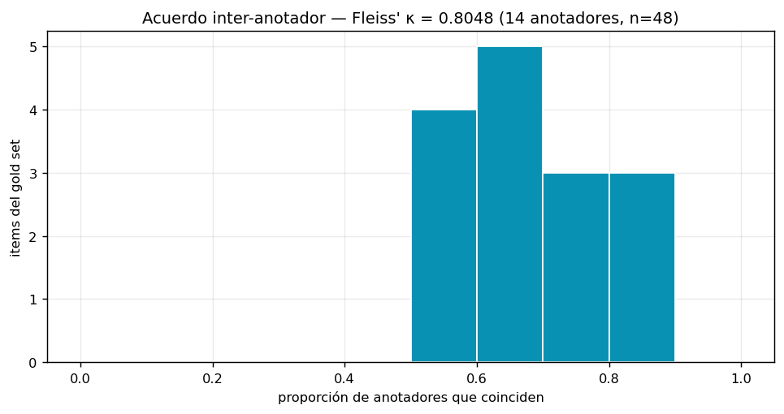

### Items más disputados

| Título | Host | Consenso | Acuerdo |
|---|---|---|---|
| (redactado) | youtube.com | 🔬 Investigación | 0.50 |
| (redactado) | x.com | 🔬 Investigación | 0.57 |
| (redactado) | youtube.com | 📰 Noticias | 0.57 |
| (redactado) | youtube.com | 🎬 Entretenimiento | 0.57 |
| (redactado) | x.com | 📰 Noticias | 0.64 |
| (redactado) | x.com | 💬 Redes Sociales | 0.64 |
| (redactado) | x.com | 💬 Redes Sociales | 0.64 |
| (redactado) | youtube.com | 🎬 Entretenimiento | 0.64 |
| (redactado) | (otro dominio) | ⚡ Productividad | 0.64 |
| (redactado) | (otro dominio) | 🎬 Entretenimiento | 0.71 |

## 2. Rendimiento del modelo desplegado (v1)

- Desacuerdo por item único: **35.99%**
- Desacuerdo ponderado por visitas reales: **31.95%** (pondera cada item por cuántas veces apareció; es lo que el usuario percibe)

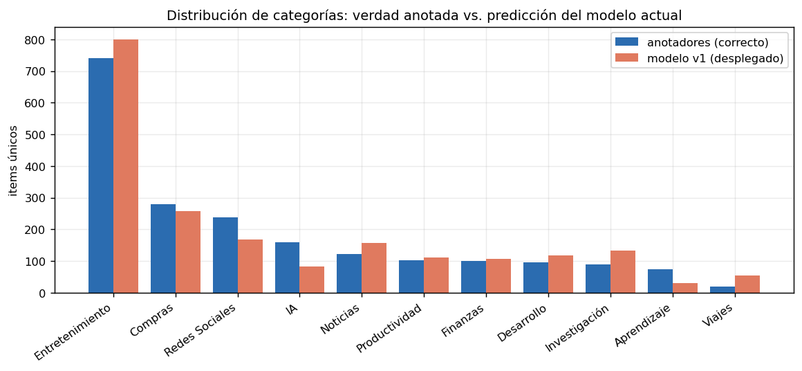
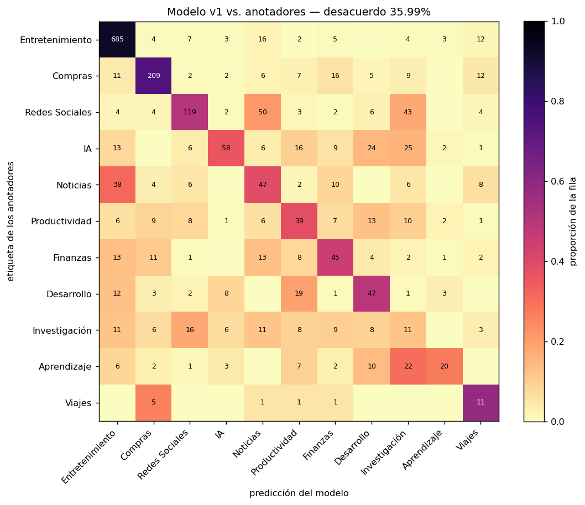
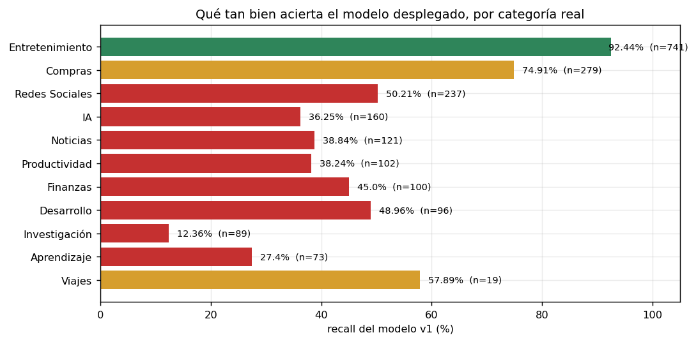

### Errores más costosos (ponderados por visitas reales)

Cada fila es una pestaña que abriste muchas veces y que el modelo coloca mal. La similitud es **alta** en casi todas: el modelo está seguro y equivocado, que es el peor modo de fallo.

| Visitas | Título | Modelo dijo | Correcto | Sim |
|---|---|---|---|---|
| 45× | Buscar \| LinkedIn | 📰 Noticias | 💬 Redes Sociales | 0.806 |
| 38× | Home / X | 🎬 Entretenimiento | 💬 Redes Sociales | 0.8016 |
| 7× | ChatGPT | 🔬 Investigación | 🤖 IA | 0.7018 |

> Se omitieron 57 filas de mayor peso cuyos títulos identifican navegación personal (búsquedas, trabajo, universidad, transacciones). El corpus completo no se publica; ver *Datos* al final.

### Confusiones más frecuentes

| n | Etiqueta real | El modelo predijo |
|---|---|---|
| 50 | 💬 Redes Sociales | 📰 Noticias |
| 43 | 💬 Redes Sociales | 🔬 Investigación |
| 38 | 📰 Noticias | 🎬 Entretenimiento |
| 25 | 🤖 IA | 🔬 Investigación |
| 24 | 🤖 IA | 💻 Desarrollo |
| 22 | 📚 Aprendizaje | 🔬 Investigación |
| 19 | 💻 Desarrollo | ⚡ Productividad |
| 16 | 🤖 IA | ⚡ Productividad |
| 16 | 🔬 Investigación | 💬 Redes Sociales |
| 16 | 🛒 Compras | 💰 Finanzas |
| 16 | 🎬 Entretenimiento | 📰 Noticias |
| 13 | 💰 Finanzas | 📰 Noticias |

### Peores hosts (≥5 items)

| Host | n | Desacuerdo |
|---|---|---|
| (otro dominio) | 6 | 100.0% |
| (otro dominio) | 6 | 100.0% |
| (otro dominio) | 5 | 100.0% |
| (otro dominio) | 5 | 100.0% |
| (otro dominio) | 5 | 100.0% |
| (campus universitario) | 14 | 85.71% |
| (otro dominio) | 7 | 85.71% |
| (desarrollo local) | 17 | 82.35% |
| (otro dominio) | 5 | 80.0% |
| (otro dominio) | 144 | 68.75% |
| x.com | 179 | 67.6% |
| (herramienta corporativa) | 5 | 60.0% |

### Calibración del umbral

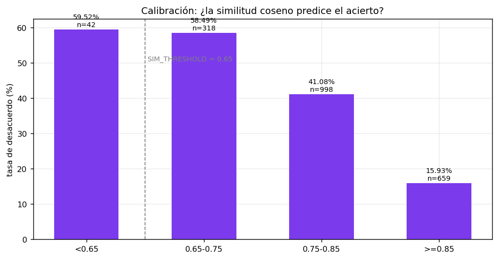

| Banda de similitud | n | Desacuerdo |
|---|---|---|
| <0.65 | 42 | 59.52% |
| 0.65-0.75 | 318 | 58.49% |
| 0.75-0.85 | 998 | 41.08% |
| >=0.85 | 659 | 15.93% |

### Categorías que faltan en la taxonomía

Los anotadores marcaron estos casos como mal encajados en las 11 categorías actuales:

| Categoría propuesta | Veces |
|---|---|
| 🎙️ Audio | 3 |
| 🌐 Navegadores | 2 |
| 🎮 Juegos | 2 |
| 🔧 Utilidades | 1 |
| 🧠 Tests | 1 |
| 🚚 Logística | 1 |
| 📦 Logística | 1 |
| 📦 Envíos | 1 |
| 🎲 Apuestas | 1 |
| 🧰 Utilidades | 1 |
| 🛠️ Utilidades | 1 |
| 🖼️ Imágenes | 1 |

## 3. Re-entrenamiento

Se evalúan **dos splits** porque miden cosas distintas:

- **por host** — ningún dominio aparece en train y test. Mide generalización a sitios nunca vistos. Es la cota inferior honesta.
- **aleatorio** — estratificado por etiqueta. Mide rendimiento en sitios ya vistos, que es el caso de uso real: el usuario revisita los mismos dominios.


| Split | Modelo | Accuracy | Acc. ponderada | macro-F1 | n test |
|---|---|---|---|---|---|
| porHost | MiniLM base | 45.7% | 43.7% | 36.7% | 405 |
| porHost | v1 (desplegado) | 45.9% | 46.4% | 32.4% | 405 |
| porHost | **v2 (nuevo)** | 53.8% | 51.3% | 48.2% | 405 |
| aleatorio | MiniLM base | 71.4% | 82.3% | 56.7% | 399 |
| aleatorio | v1 (desplegado) | 69.2% | 80.7% | 49.7% | 399 |
| aleatorio | **v2 (nuevo)** | 83.5% | 91.4% | 68.4% | 399 |

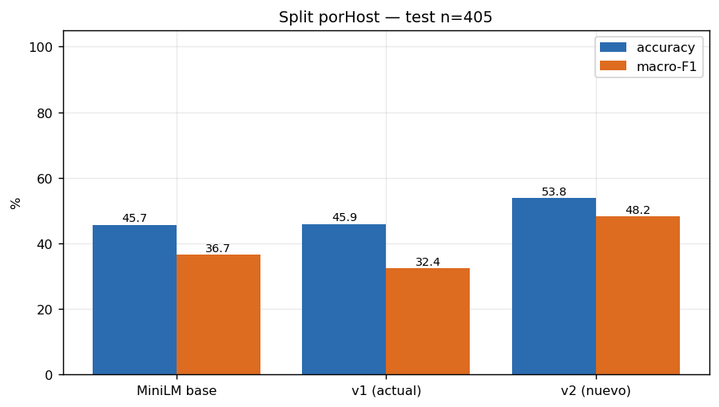
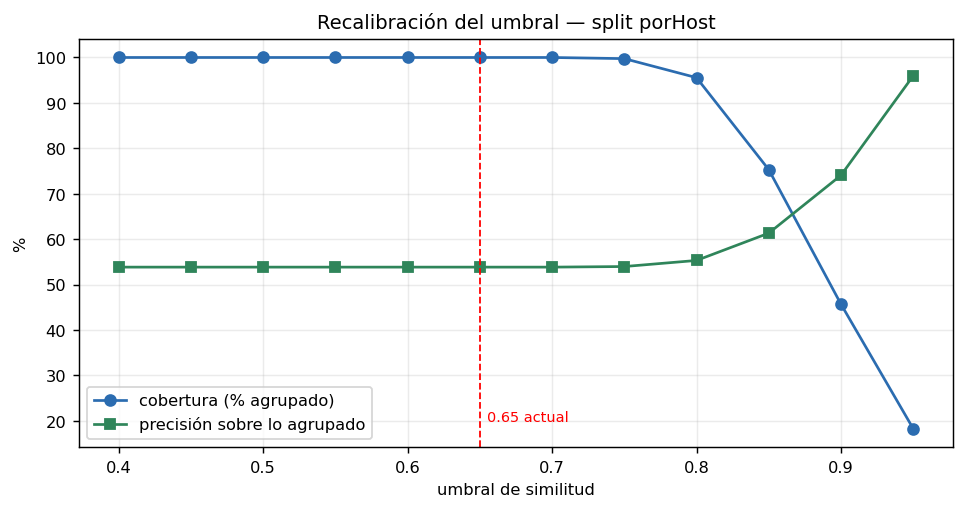
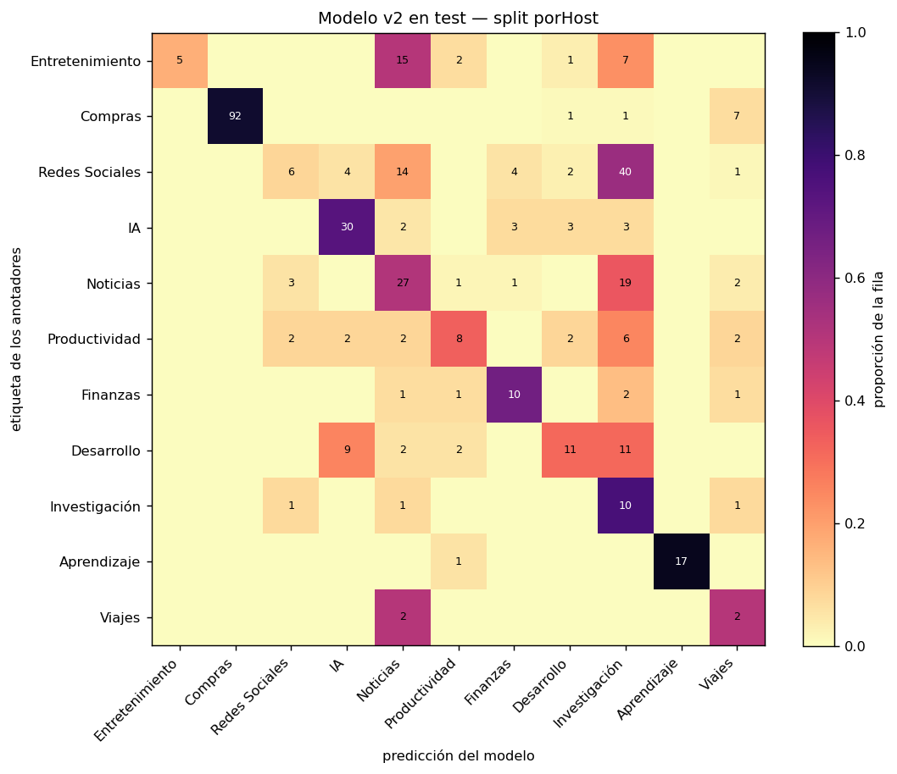

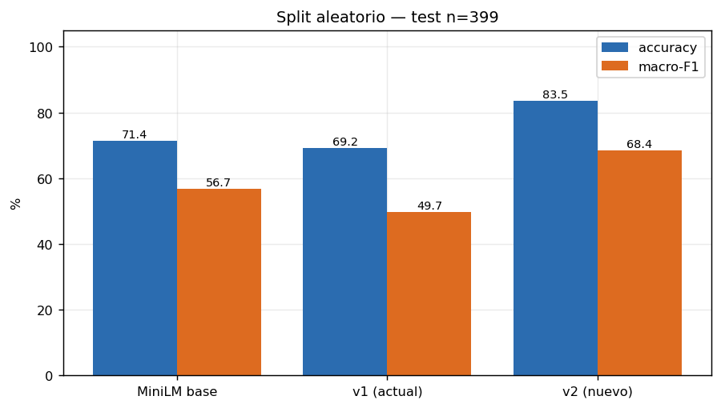
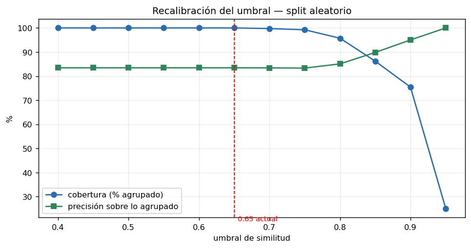
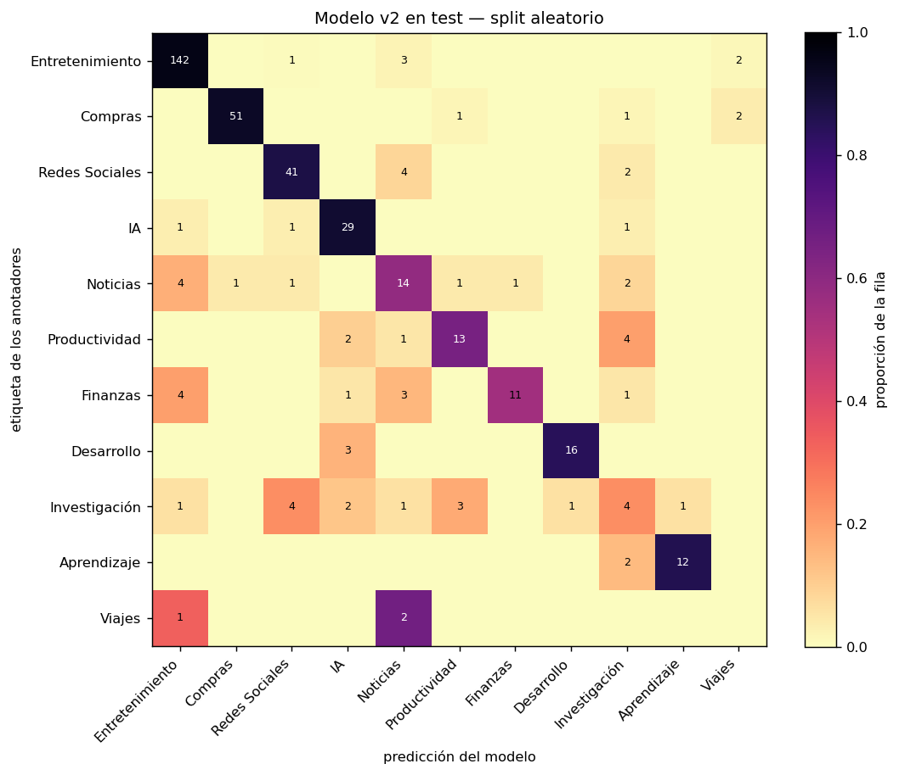

## 4. Recomendaciones

**1. Recalibrar `SIM_THRESHOLD` (`extension/offscreen.js:11`) si se despliega v2.** El valor actual (0.65) queda inoperante: el modelo v2 produce similitudes más altas y a 0.65 la cobertura es 100% — el umbral deja de filtrar nada. Puntos de operación reales:

| Umbral | Pestañas agrupadas | Aciertos entre ellas |
|---|---|---|
| 0.65 (actual) | 100.0% | 83.5% |
| 0.80 | 95.7% | 85.1% |
| 0.85 | 86.2% | 89.8% |
| 0.90 | 75.4% | 95.0% |
| 0.95 | 25.1% | 100.0% |

Recomendado **0.85**: agrupa el 86% de las pestañas acertando el 90%. Subir a 0.90 sube la precisión al 95% pero deja 1 de cada 4 pestañas sin agrupar.

**2. El fine-tune v1 fue contraproducente y conviene retirarlo.** En datos reales queda por debajo de MiniLM base en macro-F1 en ambos splits (32.4 vs 36.7 por host; 49.7 vs 56.7 aleatorio). El corpus sintético de `dataset.py` no representaba la navegación real, y el 100% LOO que reporta el README se medía sobre el propio corpus de entrenamiento.

**3. Ampliar la taxonomía.** Los anotadores señalaron repetidamente huecos donde la asignación fue forzada — ver la tabla de categorías propuestas arriba. Añadir una categoría exige tocar `finetune/dataset_v2.py` **y** `extension/prototypes.js`, y bumpear `PROTO_VERSION`.

**4. Capturar etiquetas humanas de verdad.** Todo este informe descansa en consenso de LLMs. El mecanismo de captura de movimientos manuales ya existe en `background.js` y produce la señal de mayor calidad, pero el export no traía ni una: conviene verificar que `datasetEnabled` estuvo activo y que arrastrar pestañas entre grupos registra `userCategory`.


## 5. Datos

El corpus de origen es navegación personal real y **no se publica**: `items.json`, `labeled.json`, `shards/`, `out/` y `dataset_v2.py` están en `.gitignore`. Los títulos que aparecen en este informe pasaron por `sanitize.py`, que solo deja pasar títulos estructurales de sitios de uso masivo; todo lo demás se redacta u omite.

Los centroides de `extension/prototypes.js` se publican como **vectores precomputados** (384 dims, media normalizada de ~180 embeddings por categoría) en lugar de textos de ejemplo, por la misma razón.


## 6. Reproducir

```bash
cd finetune && source .venv/bin/activate
python relabel/consolidate.py   # valida shards → labeled.json + agreement.json + disagreement.json
python relabel/train_v2.py      # re-entrena, evalúa ambos splits → output/metrics_v2.json
python relabel/report.py        # gráficas + este informe
```
